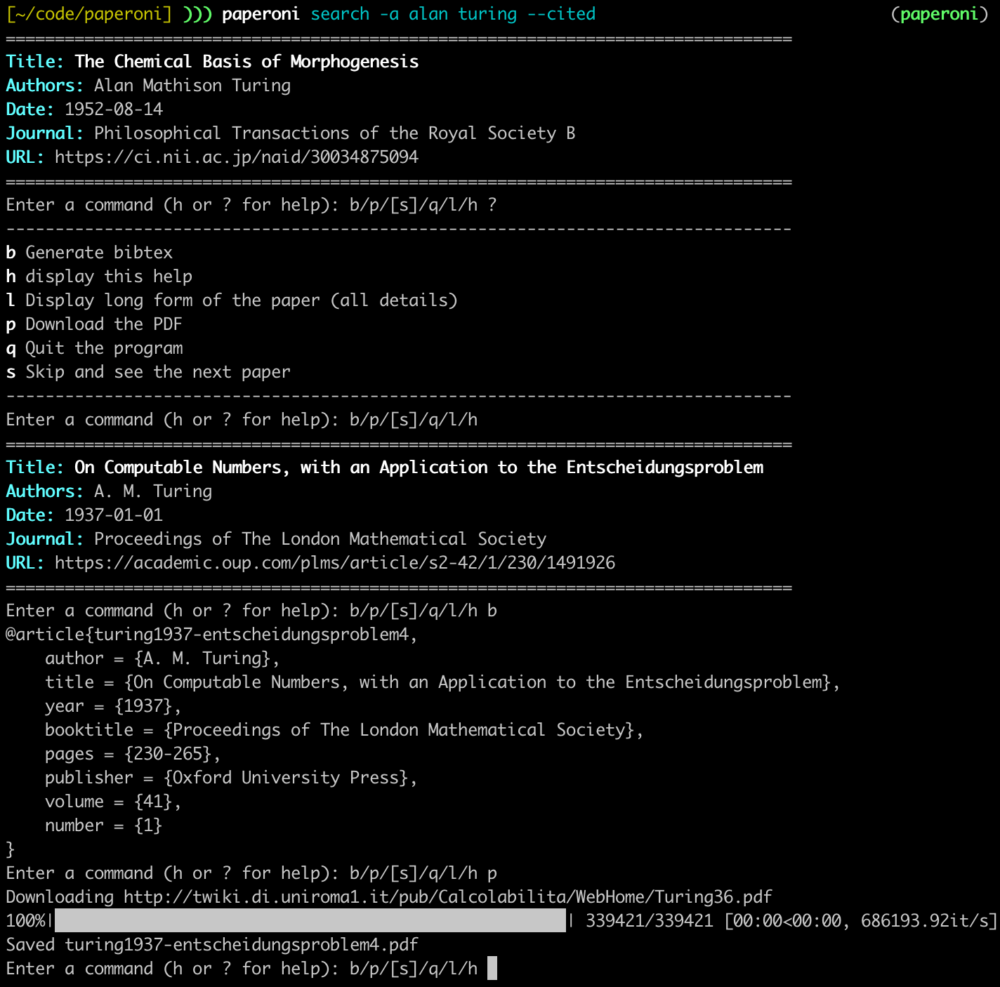

# Paperoni

* **Search** for scientific papers on the command line
* **Download PDFs**
* Generate **BibTeX** entries
* Build **collections** of papers



Paperoni uses the Microsoft Academic Knowledge API, which requires an API key:

**[Get a Microsoft Academic Knowledge API key](https://msr-apis.portal.azure-api.net/products/project-academic-knowledge)** (free tier: 10,000 queries per month, trust me, that's plenty)


## Install

```bash
pip install paperoni

# This will prompt for the API key
paperoni config
```

## Overview

This is a curated set of examples of things you can do with Paperoni. Most of the flags shown below can be combined.

```bash
# Search for papers from an author
paperoni search -a alan turing

# Search for papers with a certain title
paperoni search -t the chemical basis of morphogenesis

# Search for the most cited AI papers of 2017
paperoni search -k artificial_intelligence -y 2017 --cited

# Collect papers into a file
paperoni collect -c my-papers.json -a olivier breuleux -y 2018

# Dump BibTeX for all papers in a collection
paperoni bibtex -c my-papers.json >> papers.bib

# Collect info about a researcher into a file (interactive)
paperoni researcher -r researchers.json -a olivier breuleux

# Search for papers from researchers with status "phd"
paperoni search -r researchers.json --status phd
```

## Search

The `paperoni search` command allows you to search for papers:

```
$ paperoni search -h
usage: paperoni search [-h] [--author [VALUE [VALUE ...]]]
                       [--cited | --no-cited] [--collection VALUE]
                       [--command VALUE] [--end VALUE]
                       [--institution [VALUE [VALUE ...]]] [--key VALUE]
                       [--keywords [VALUE [VALUE ...]]] [--limit NUM]
                       [--offset NUM] [--recent | --no-recent]
                       [--researchers VALUE] [--start VALUE]
                       [--status [VALUE [VALUE ...]]]
                       [--title [VALUE [VALUE ...]]] [--venue VALUE]
                       [--verbose | --no-verbose]
                       [--words [VALUE [VALUE ...]]] [--year NUM]

optional arguments:
  -h, --help            show this help message and exit
  --author [VALUE [VALUE ...]], -a [VALUE [VALUE ...]]
                        Search for an author
  --cited               Sort by most cited
  --collection VALUE, -c VALUE
                        File containing the collection
  --command VALUE       Command to run on every paper
  --end VALUE           End date (yyyy-mm-dd or yyyy)
  --institution [VALUE [VALUE ...]], -i [VALUE [VALUE ...]]
                        Search papers from institution
  --key VALUE           Microsoft Cognitive API key
  --keywords [VALUE [VALUE ...]], -k [VALUE [VALUE ...]]
                        Search for keywords
  --limit NUM           Number of papers to fetch (default: 100)
  --offset NUM          Search offset
  --recent              Sort by most recent
  --researchers VALUE, -r VALUE
                        Researchers file (JSON)
  --start VALUE         Start date (yyyy-mm-dd or yyyy)
  --status [VALUE [VALUE ...]]
                        Researcher status(es) to filter for
  --title [VALUE [VALUE ...]], -t [VALUE [VALUE ...]]
                        Search words in the title
  --venue VALUE         Search papers from a specific conference or journal
  --verbose, -v         Verbose output
  --words [VALUE [VALUE ...]], -w [VALUE [VALUE ...]]
                        Search words in the title or abstract
  --year NUM, -y NUM    Year
```

The interface will list each result interactively, allowing you to perform actions:

* `l` to show more information about the paper: abstract, affiliations, all links
* `b` to print out a BibTeX entry for the paper (see also `paperoni bibtex`)
* `p` to save the PDF in the current directory, if a PDF is available (and doesn't require authentication or captchas)


## Collections

It is possible to save papers into collections using:

```bash
# Assuming you want your collection to be in my-collection.json
paperoni collect -c my-collection.json
```

The options are the same as `search`, but you can sort through the search results to add papers to the collection or reject them. Papers that were already added or rejected will be ignored, so the collection can be built incrementally by reusing the same search string and going through any new papers.

`paperoni search -c my-collection.json` will search for papers in the collection. The search algorithm may be slightly different since it is a purely local search.

## Researchers database

For more advanced uses you can create a researchers file that contains one or more people. You can make one for yourself, or for your organization. For example, you can add every researcher in your organization or laboratory along with their hiring dates in order to get all of your organization's publications.

`paperoni researcher -r researchers.json -a author name` will guide you interactively. First you will be asked whether certain papers are from the author or not, to weed out homonyms. Then you can optionally assign one or more statuses. A "status" is some arbitrary tag with optional start and end dates that can be assigned to a researcher.

Then you can write for example `paperoni collect -c org.json -r researchers.json --status xyz` to collect papers from researchers when they had a given status. The feature is also compatible with `paperoni search`, of course.

## FAQ

**I cannot find a paper.**

Paperoni uses [Microsoft Academic](https://academic.microsoft.com/home) to find papers. First check if you can find the paper there. If it is indeed there, this is a bug with Paperoni and you should file an issue.

If it isn't, the most likely reason is that the paper is too recent and has not yet been indexed. It can sometimes take a few weeks before a paper is indexed.

**The PDF download does not work.**

Try the `l` command, which will list all links pertaining to the paper, organized by type. Try opening them in your browser, it might work better.

**Can I manually enter a new paper into a collection?**

Assuming you mean a paper that is not indexed in the database, the answer, unfortunately, is no. 

<!-- Feel free to request this feature by voting on issue [TODO: issue]. -->


**Can I remove a paper from a collection?**

Yes, search for the paper(s) to remove, passing the collection using the `-c` argument, and use the `r` interactive command to remove it.

```
$ paperoni search -c collection.json -t the paper title
================================================================================
Title: The paper title
Authors: Some Guy
Date: 2020-02-02
================================================================================
Enter a command (h or ? for help): b/p/[s]/r/q/l/h r
Removed 'The paper title' from the collection.
```

You can use `--command r` to do this non-interactively.
