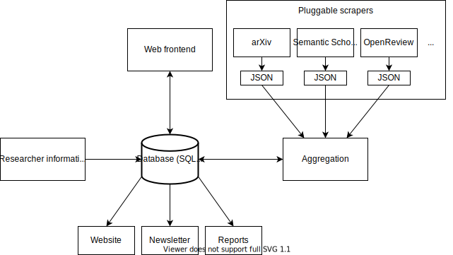

# Design

Paperoni is designed around a set of scrapers populating a SQL (currently SQLite) database:

## Data model

* The SQL schema is defined in [database.sql](../paperoni/db/database.sql)
* A SQLAlchemy model is generated into [schema.py](../paperoni/db/schema.py) (run [regen.schema.sh](../scripts/regen-schema.sh))
* There is also a Pydantic model in [model.py](../paperoni/model.py)

In a nutshell, a paper may have multiple authors, and each author may have multiple affiliations that are listed *on the paper itself* (meaning that an affiliation must be associated to a (Paper, Author) pair and not to an Author directly). A paper may also have multiple *releases*: for example, a preprint on arxiv on 2022-05-03 would be one release, and a publications to NeurIPS on 2022-12-05 would be another release for the same paper. In addition to that, a paper may have multiple topics (keywords), and multiple *links*. A link is basically an identifier, so it has a type (html, pdf, arxiv, doi, etc.) and a "link" which can be a url or an id.

Authors can also have links (orcid, semantic scholar id, openreview profile, etc.)

Authors, institutions and venues can have *aliases*.

## Scrapers

See [new-scrapers](new-scrapers.md) for information about the design of scrapers.

See [scrapers](scrapers.md) for a list of existing parsers.

Basically, a scraper has the following methods:

* **query**, either for testing purposes or as a feature in and of itself.
* **prepare**, to acquire e.g. IDs for a new researcher. This is usually an interactive process.
* **acquire**, to acquire papers (or other data, such as venues) and put them in the database.

## Data integration

When a scraper produces a paper, it may only represent part of the truth: maybe it only finds one of several releases, maybe it doesn't tell us the affiliations of the authors, and so on. Here is how paperoni integrates the information:

1. It calculates a recursive hash of the incoming data (paper, authors, links, etc.)
2. This hash is used as the primary key for the data, to avoid creating duplicate rows, and the first bit is forced to 1 (or 0, I don't remember exactly, but it doesn't matter).
3. If multiple rows actually represent the same paper, they should be merged.
4. Rows to merge might be identified in various ways: same title and authors, one link in common, or user action.
5. If rows A, B and C must be merged:
   1. They are ordered using the quality field (better quality sources are preferred)
   2. They are merged into row D for which the primary key is calculated to be the minimum of A, B and C's primary keys, with the first bit flipped to 0 (basically means the row is mutable).
   3. All foreign keys that point to A, B and C are moved to D.
   4. Authors or affiliations are not merged at the same time as papers, they require their own merge. A paper with two authors may thus end up with four (two pairs of duplicates).

## History and caching

### History

When adding new data from scrapers or when merging, the new records or merge requests are serialized to JSON and dumped in .jsonl files in the history directory. It is possible to run `paperoni replay <file>` to reintegrate some records, or `paperoni replay --after 2023-01-01` to select filenames that are after `2023-01-01` alphabetically (`2023-01-01` is not interpreted as a date, it's a file prefix).

This makes debugging or recovering from a bad state a bit easier since you can wipe out the database and replay everything from the beginning.

### Cache

There are two caches, one mainly for downloading PDFs, and the other for the `requests` library.

The `cache` directory specified by the config is used to store downloaded PDFs and their text-only versions for the `refine` scraper.

The `requests_cache` directory in the config, if it is set, will cache queries to websites and APIs for six days. This avoids needlessly hammering APIs with the same requests during development.
